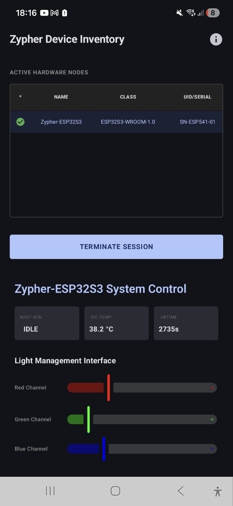

# Project Demonstration
This side‑project prototype was created in spare time to showcase a wide range of skills:
- C++17 (OOP, templates, RAII, std::thread, FreeRTOS)
- ESP32‑S3 microcontroller: GPIO, I2C, SPI, UART, Wi‑Fi, BLE
- Low‑level register and peripheral access
- Android integration with Kotlin (JNI/NDK, coroutines, Jetpack Compose)
- Multithreading, SMP (dual‑core ESP32‑S3), task synchronization
- Network programming (TCP/UDP, IP‑event handling)
- Basic cryptography (challenge‑response, recommendation to use HMAC‑SHA256)
- Build configuration with ESP‑IDF, CMake, Ninja
- All Rights Reserved licensing

# Zypher Ecosystem: High-Performance Multi-Platform IoT Framework

[All Rights Reserved](#)
[](https://www.espressif.com/en/products/socs/esp32-s3)
[](https://www.freertos.org/)
[](https://kotlinlang.org/)

## 1. Project Overview
The **Zypher Ecosystem** is a production-grade demonstration of a modern, heterogeneous IoT infrastructure. It comprises a deterministic embedded firmware (Slave) and a reactive mobile dashboard (Master). The framework is engineered to showcase advanced implementation patterns for low-latency hardware management, secure cryptographic session handling, and distributed resource processing.

> **Disclaimer**: This is a **Technical Portfolio Project**. It is intended for technical evaluation of engineering proficiency, architectural design, and hardware-software integration. It serves as a proof-of-concept for industrial IoT and safety-critical system patterns.

<p align="center">
  
  <br>
  <em>Figure 1: Reactive Android Dashboard providing real-time hardware telemetry and RGB control.</em>
</p>

---

## 2. Technical Architecture & Engineering Decisions

### 2.1 Deterministic Symmetric Multiprocessing (SMP)
To achieve zero-jitter hardware control, the ESP32-S3 firmware utilizes a strict core-pinning strategy via FreeRTOS:
*   **Core 0 (System & Comms)**: Manages the LwIP TCP/IP stack, Wi-Fi drivers, and the Zypher Network Engine. Isolation here ensures that high network traffic does not disrupt physical timings.
*   **Core 1 (Hardware & Real-Time)**: Dedicated to the Hardware Abstraction Layer (HAL), high-speed ISR handling, and the sinusoidal LED breathing engine.

### 2.2 Zypher Binary Protocol
Communication is governed by a proprietary **Binary UDP Protocol** optimized for high throughput.
*   **Data Integrity**: Uses packed structures (`#pragma pack`) to ensure absolute bit-alignment between the Xtensa C++ environment and the Android JVM.
*   **Secure Handshake**: Implements a **Challenge-Response** model. Challenges are generated using the ESP32 hardware TRNG and verified via an **FNV-1a + MurmurHash3 mixer**.
*   **Reliability**: Implements a robust state machine with mandatory ACK confirmations for lifecycle transitions (**Discovery -> Capture -> Control -> Release**).

---

## 3. Project Structure
```text
Zypher_and_Android/
├── common/                  # Single Source of Truth
│   └── include/
│       ├── protocol.hpp     # Shared binary packet definitions
│       └── wifi_credentials.hpp.template
├── ESP32_Slave/             # Embedded Firmware (C++17 / ESP-IDF)
│   ├── main/
│   │   ├── network_processor.hpp # Multi-threaded net engine
│   │   ├── gpio_manager.hpp      # Peripheral drivers & ISRs
│   │   └── wifi_manager.hpp      # Fail-safe Wi-Fi connectivity
│   └── sdkconfig            # Industrial build optimization
└── Androind_Ctrl/           # Mobile Master (Kotlin)
    └── app/src/main/java/   # Jetpack Compose UI & Coroutine streams
```

---

## 4. Key Implementation Features

### Embedded Systems (C++)
*   **Industrial Coding Standards**: Adherence to **MISRA C++** principles (Safe Type Casting, static allocation, fixed-width types).
*   **High-Speed Interfacing**: Implementation of a specialized ISR with IRAM placement to resolve GCC 14 relocation issues on Xtensa.
*   **Thermal & Power Management**: Real-time die temperature monitoring and optimized task sleep cycles.

### Mobile Engineering (Kotlin)
*   **Reactive Data Binding**: Jetpack Compose based dashboard with real-time hardware state synchronization.
*   **High-Concurrency Networking**: Multi-stream UDP management (RX/TX/Monitoring) utilizing Kotlin Coroutines for a non-blocking UI experience.

---

## 5. Getting Started

### Prerequisites
*   **ESP-IDF v5.4+**
*   **Android Studio Ladybug+**
*   **Python 3.11+**

### Building the Slave Firmware
1. `cd ESP32_Slave`
2. `cp ../common/include/wifi_credentials.hpp.template ../common/include/wifi_credentials.hpp`
3. Edit `wifi_credentials.hpp` with your local network details.
4. `idf.py build flash monitor`

### Building the Master App
1. Open `Androind_Ctrl` in Android Studio.
2. Synchronize Gradle and deploy to a physical device on the same local network.

---

# 6. Roadmap

**Q2 2026**
- **v1.0** – Stable FreeRTOS + Android implementation (released)
- **v1.1** – Port to Zephyr RTOS to showcase cross‑RTOS expertise
- **v1.2** – Add OTA update mechanism (Secure boot & encrypted firmware)
- **v1.3** – Implement FreeRTOS port for alternative MCU (e.g., ESP32‑C3)  
- **v1.4** – Implement Zypher OS port – lightweight custom RTOS for deterministic tasks

**Q3 2026**
- **v2.0** – Integrate hardware‑accelerated AES‑GCM for end‑to‑end encryption
- **v2.1** – Implement telemetry dashboard with Prometheus export from ESP32
- **v2.2** – Add automated regression test suite (Unity, Ceedling, Android UI tests)

**Q4 2026**
- **v1.0** – Stable FreeRTOS + Android implementation (released)
- **v1.1** – Port to Zephyr RTOS to showcase cross‑RTOS expertise
- **v1.2** – Add OTA update mechanism (Secure boot & encrypted firmware)

**Q1 2027**
- **v2.0** – Integrate hardware‑accelerated AES‑GCM for end‑to‑end encryption
- **v2.1** – Implement telemetry dashboard with Prometheus export from ESP32
- **v2.2** – Add automated regression test suite (Unity, Ceedling, Android UI tests)

**Q2 2027**
- **v3.0** – Full TLS/DTLS stack with mutual authentication
- **v3.1** – Release Android app to Google Play (signed, production ready)
- **v3.2** – Performance & power profiling suite (Espressif Power Profiler)

**Long‑term**
- 🛡️ **v4.0** – Formal security audit and certification (ISO 27001)
- 🤝 **v4.1** – Open‑source SDK for third‑party peripheral integration

# Project Demonstration
This side‑project prototype was created in spare time to showcase a wide range of skills:
- C++17 (OOP, templates, RAII, std::thread, FreeRTOS)
- ESP32‑S3 microcontroller: GPIO, I2C, SPI, UART, Wi‑Fi, BLE
- Low‑level register and peripheral access
- Android integration with Kotlin (JNI/NDK, coroutines, Jetpack Compose)
- Multithreading, SMP (dual‑core ESP32‑S3), task synchronization
- Network programming (TCP/UDP, IP‑event handling)
- Basic cryptography (challenge‑response, recommendation to use HMAC‑SHA256)
- Build configuration with ESP‑IDF, CMake, Ninja
- All Rights Reserved licensing

---

## 8. Next‑Level Improvements

- **Automated testing** – unit‑tests for all C/C++ modules, integration tests for the firmware‑Android communication, and UI test suites.
- **Continuous Integration / Delivery** – GitHub Actions (or Azure Pipelines) that run static analysis, linting (`clang‑tidy`, `cppcheck`), build verification for both firmware and Android app, and generate code‑coverage reports.
- **Static analysis & code quality** – Enforce MISRA‑C++ guidelines, run `clang‑format` checks, enable address‑sanitizer and thread‑sanitizer in CI.
- **Security hardening** – Replace the custom challenge‑response with TLS/DTLS (or at least HMAC‑SHA256), protect private keys in secure flash, and perform a threat model review.
- **Performance & power profiling** – Measure ISR latency, CPU load per core, and real‑time power consumption; add runtime metrics to the dashboard.
- **Stress & reliability testing** – Long‑duration (24 h+) runs with network interruptions, temperature extremes, and power‑cycle scenarios.
- **Modular architecture** – Refactor Wi‑Fi manager and networking stack into separate libraries, expose clean APIs, and add comprehensive documentation (Doxygen) with generated HTML.
- **System diagrams** – Add block‑level and data‑flow diagrams (Mermaid) in the README to visualise SMP core‑pinning, protocol stack, and Android‑to‑firmware communication.
- **Versioned release process** – Semantic versioning, changelog, and release artefacts (binary firmware, signed APK) with reproducible builds.
- **Extensive documentation** – Full API reference for `common/include/protocol.hpp`, hardware register maps, and onboarding guide for new developers.

These items will bring the project from a solid mid‑senior showcase to an 8‑9 senior‑level portfolio.

---

# Zypher Ecosystem: High-Performance Multi-Platform IoT Framework

[All Rights Reserved](#)

## 7. License
This project is **All Rights Reserved** – you may view the source, but copying, modifying, or distributing it requires explicit permission from the author. See the [LICENSE](LICENSE) file for details.

⚠️ **Proprietary Cryptographic Component** – The firmware implements a proprietary challenge‑response algorithm for secure session establishment. The source code may be reviewed, but copying, modifying, or re‑using the algorithm in other projects is prohibited without explicit permission from the author.

*Why this approach is simple and safe:* The algorithm combines a hardware‑generated random nonce with a fast, non‑cryptographic FNV‑a hash followed by a MurmurHash3‑style mixer. This lightweight construction provides high entropy and avalanche effects while consuming only a few CPU cycles, ideal for resource‑constrained IoT devices. For the demo’s purpose it offers sufficient protection without the complexity and overhead of full‑blown PKI or AES‑GCM solutions.

---
*Developed by R.A. (Senior Embedded Systems Engineer)*
